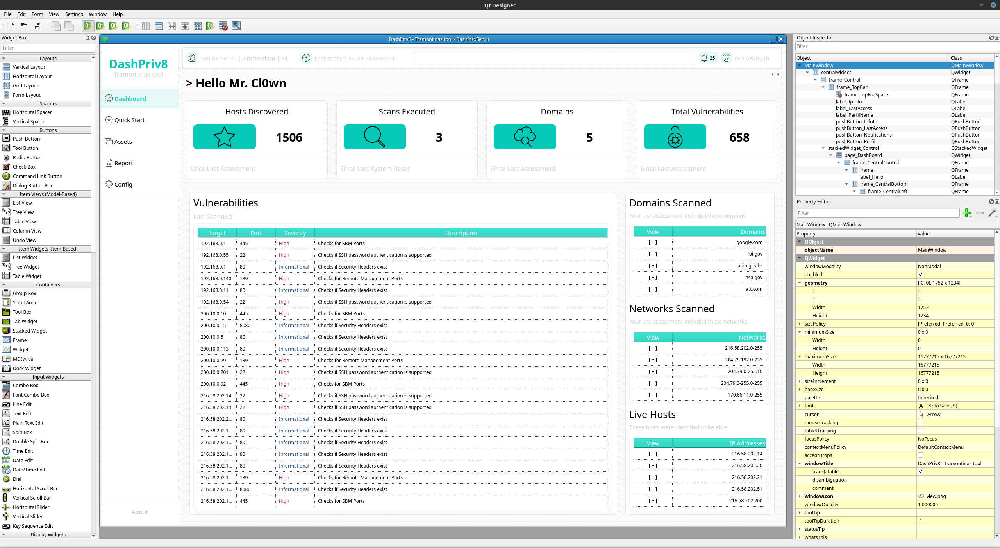
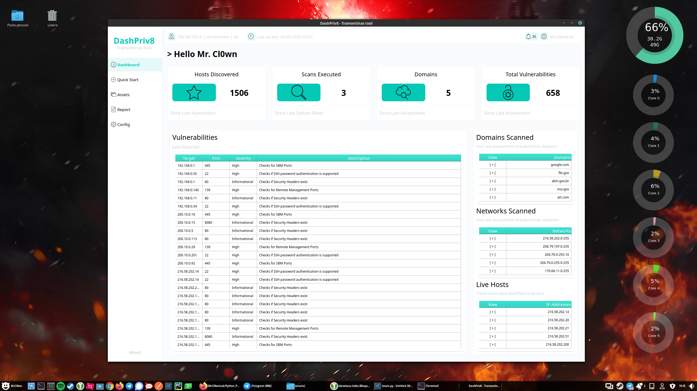

# Python PySide2 DashBoard InfoSec Green

[](https://www.python.org/)
[]()
[]()

--
This is the study of an interface with PySide2 /
Python - DashBoard - Modern Gui [Qt Designer, PySide2] 

## Using Qt Designer
Qt Designer is the Qt tool for designing and building graphical user interfaces (GUIs) with Qt Widgets. You can compose and customize your windows or dialogs in a what-you-see-is-what-you-get (WYSIWYG) manner, and test them using different styles and resolutions.


Qt Designer: https://doc.qt.io/qt-5/qtdesigner-manual.html
## Installation
Use the package manager [pip](https://pip.pypa.io/en/stable/).
## Pip

```
pip install PySide2
```
## Use
```
$ python main.py
```

## Files
```bash
├── assets
│   ├── files.py
│   ├── files.qrc
│   ├── icons
│   └── *.png
│   ├── __init__.py
│   └── prints
│       ├── form.png
│       └── qt.png
├── DashInfoSec.ui
├── LICENSE
├── main.py
├── README.md
└── ui_DashInfoSec.py
4 directories, 391 files
```

## Select tab dashboard
```python
# CLICK SELECT DASHBOARD
self.ui_main.pushButton_DashBoard.clicked.connect(lambda: self.click_select_tab(0))
# CLICK SELECT QUICKSTART
self.ui_main.pushButton_QuickStart.clicked.connect(lambda: self.click_select_tab(1))
# CLICK SELECT ASSETS
self.ui_main.pushButton_Assets.clicked.connect(lambda: self.click_select_tab(2))
# CLICK SELECT REPORT
self.ui_main.pushButton_Report.clicked.connect(lambda: self.click_select_tab(3))
# CLICK SELECT CONFIG
self.ui_main.pushButton_Config.clicked.connect(lambda: self.click_select_tab(4))
# CLICK SELECT ABOUT
self.ui_main.pushButton_About.clicked.connect(lambda: self.click_select_tab(5))

def click_select_tab(self,index_int:int):
    self.ui_main.stackedWidget_Control.setCurrentIndex(index_int)
```
# My study reference
- https://www.bootstrapdash.com/demo/aquaui/template/demo_2/index.html
- https://www.kitploit.com/2020/09/nerve-network-exploitation.html

